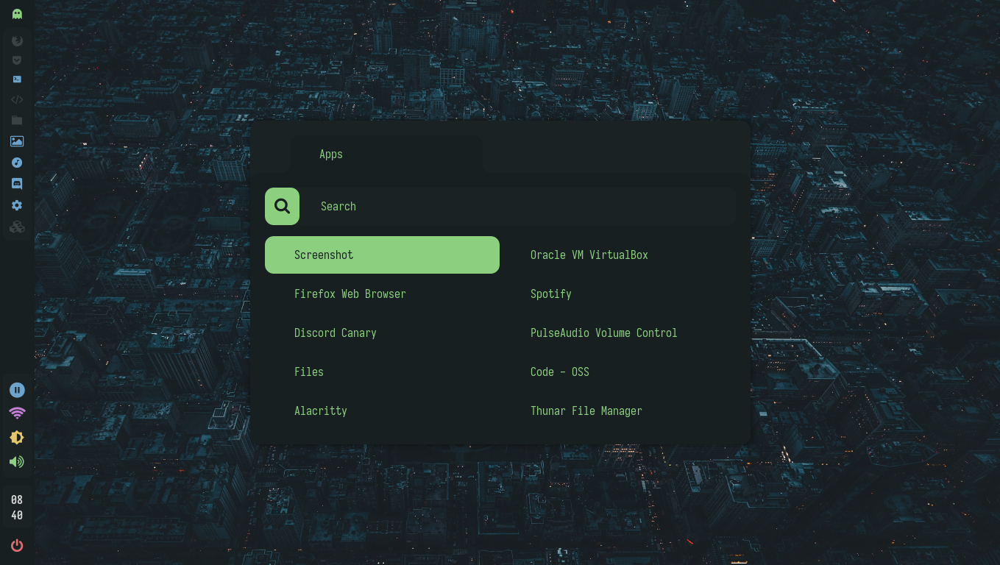

<h2 align="center">Everblush Rofi Themes</h2>

<p>
<h4 align="center"> <i>Everblush with different rofi configs </i> </h4>
</p> 

<p align="center"> 

</p>

# Rxyhn's Rofi
<p align="center"> 
 
</p>

# AlphaTechnolog's Rofi
<p align="center">

</p>

## Installation
- Add the respected config.rasi file to your ```~/.config/rofi```.

# Note
- All the everblush users can pr there various rofi configuration files on this repository if they want. 

## Credits 💝
- [rxyhn](https://github.com/rxyhn).
